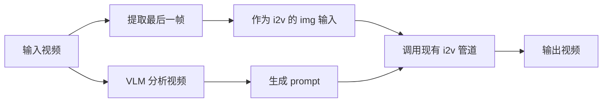
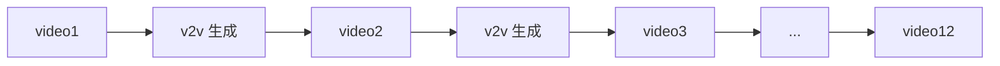

# Video-to-Video (V2V) 功能实现计划

为 Wan2.2 添加 Video-to-Video 生成功能，输入一个视频，自动提取最后一帧作为参考图，并用 VLM 生成视频描述作为 prompt。


### Dependencies

- `timm`

## ✅ 实现状态: 已完成

## 核心设计



## 设计决策

| 决策项 | 选择 |
|--------|------|
| VLM 模型 | `InternVL3_5-8B` |
| 视频采样帧数 | `num_segments=8` |
| Prompt 模板 | `"Describe this video in detail."` |
| 命令行入口 | `--task v2v-14B` 或 `--task v2v-5B` |
| VLM 设备 | `vlm_device` 参数，支持多 GPU |

---

## 模型架构对比

| 特性 | v2v-14B | v2v-5B |
|------|---------|--------|
| 基础模型 | I2V-A14B | TI2V-5B |
| VAE | `Wan2_1_VAE` | `Wan2_2_VAE` |
| DiT 模型 | 双模型 (low_noise + high_noise) | 单模型 |
| 支持分辨率 | `720*1280`, `1280*720`, `480*832`, `832*480` | `704*1280`, `1280*704` |
| 参数量 | 14B | 5B |
| 显存占用 | 较高 | 较低 |
| Pipeline 类 | `WanV2V` | `WanV2V5B` |

---

## 已完成的修改

### v2v-14B (原有)

#### [video2video.py](file:///home/user1/workspace/juyi/Wan2.2/wan/video2video.py)

- ✅ 新增导入: `decord`, `transformers`, `numpy`
- ✅ `__init__` 添加 `vlm_path`, `vlm_device` 参数
- ✅ 新增 VLM helper 方法:
  - `_load_vlm()` - 延迟加载 VLM
  - `_build_vlm_transform()` - 构建图像变换
  - `_vlm_dynamic_preprocess()` - 动态图像分块
  - `_extract_last_frame()` - 提取视频最后一帧
  - `_summarize_video()` - 采样 8 帧，调用 VLM 生成描述
- ✅ 新增 `v2v()` 方法

---

### v2v-5B (新增)

#### [wan22video2video5B.py](file:///home/user1/workspace/juyi/Wan2.2/wan/wan22video2video5B.py) [NEW]

基于 TI2V-5B 架构的 Video-to-Video 实现:

- ✅ 新建文件，创建 `WanV2V5B` 类
- ✅ 使用 `Wan2_2_VAE` (Wan2.2 版本 VAE)
- ✅ 使用单模型架构 (vs 14B 的双模型)
- ✅ 复用 VLM helper 方法
- ✅ `generate()` 方法 - 图像到视频生成
- ✅ `v2v()` 方法 - 视频到视频生成

**核心差异:**
```python
# v2v-14B: 双模型 + Wan2_1_VAE
self.low_noise_model = WanModel.from_pretrained(...)
self.high_noise_model = WanModel.from_pretrained(...)
self.vae = Wan2_1_VAE(...)

# v2v-5B: 单模型 + Wan2_2_VAE  
self.model = WanModel.from_pretrained(...)
self.vae = Wan2_2_VAE(...)
```

---

### [generate.py](file:///home/user1/workspace/juyi/Wan2.2/generate.py)

- ✅ 添加 `v2v-14B` 到 `EXAMPLE_PROMPT`
- ✅ 添加 `v2v-5B` 到 `EXAMPLE_PROMPT`
- ✅ 添加 CLI 参数: `--video`, `--vlm_device`
- ✅ 更新验证逻辑支持 `v2v-14B` 和 `v2v-5B`
- ✅ 添加条件分支:
  - `v2v-5B` → 使用 `WanV2V5B`
  - `v2v-14B` → 使用 `WanV2V`

---

### [configs/__init__.py](file:///home/user1/workspace/juyi/Wan2.2/wan/configs/__init__.py)

- ✅ 添加 `v2v_14B` 配置 (复用 `i2v_A14B`)
- ✅ 添加 `v2v_5B` 配置 (复用 `ti2v_5B`)
- ✅ 添加 `v2v-14B` 到 `WAN_CONFIGS` 和 `SUPPORTED_SIZES`
- ✅ 添加 `v2v-5B` 到 `WAN_CONFIGS` 和 `SUPPORTED_SIZES`

---

## 使用方法

### 单次 V2V 生成

```bash
# v2v-14B (使用 I2V-A14B 模型)
python generate.py --task v2v-14B --video input.mp4 --ckpt_dir ./Wan2.2-I2V-A14B

# v2v-5B (使用 TI2V-5B 模型) - 更低显存占用
python generate.py --task v2v-5B --video input.mp4 --ckpt_dir ./Wan2.2-TI2V-5B --size 704*1280

# VLM 在不同 GPU 上运行
python generate.py --task v2v-5B --video input.mp4 --ckpt_dir ./Wan2.2-TI2V-5B --vlm_device cuda:1

# 使用自定义 prompt
python generate.py --task v2v-5B --video input.mp4 --ckpt_dir ./Wan2.2-TI2V-5B --prompt "A cat playing"
```

### Continuous Generations (连续视频生成)

新增脚本 `generate_continuous.py` 支持**链式连续视频生成**：



#### 核心流程

1. 读取 `video1`，提取**最后一帧** + VLM 分析生成 prompt
2. 调用 i2v 生成 `video2`
3. 读取 `video2`，重复步骤 1-2
4. 循环直到生成指定数量的视频 (默认 12 个)

#### 使用方法

```bash
# 基础用法 - 从 input.mp4 开始连续生成 12 个视频
python generate_continuous.py --video input.mp4 --ckpt_dir ./Wan2.2-I2V-A14B

# 自定义生成数量
python generate_continuous.py --video input.mp4 --ckpt_dir ./Wan2.2-I2V-A14B --num_videos 6

# 指定输出目录和 VLM 设备
python generate_continuous.py \
    --video input.mp4 \
    --ckpt_dir ./Wan2.2-I2V-A14B \
    --output_dir ./my_continuous_videos \
    --vlm_device cuda:1

# 完整参数示例
python generate_continuous.py \
    --video input.mp4 \
    --ckpt_dir ./Wan2.2-I2V-A14B \
    --num_videos 12 \
    --output_dir ./continuous_outputs \
    --frame_num 81 \
    --sample_steps 40 \
    --sample_guide_scale 5.0 \
    --base_seed 42 \
    --custom_prompt "continue video slowly"
```

#### 参数说明

| 参数 | 默认值 | 说明 |
|------|--------|------|
| `--video` | (必需) | 初始输入视频路径 |
| `--num_videos` | 12 | 要生成的视频总数 |
| `--output_dir` | `./continuous_outputs` | 输出目录 |
| `--ckpt_dir` | (必需) | 模型 checkpoint 路径 |
| `--frame_num` | 81 | 每个视频的帧数 (4n+1) |
| `--base_seed` | 随机 | 基础种子，每个视频使用 `base_seed + index` |
| `--custom_prompt` | `"continue video"` | 自定义 prompt 前缀 |
| `--vlm_device` | 与主模型相同 | VLM 模型设备 |

#### 输出

- 视频文件: `video_01_*.mp4`, `video_02_*.mp4`, ..., `video_12_*.mp4`
- Prompt 日志: `prompts_log.txt` (记录每个视频对应的 VLM 生成的描述)

---

## 文件结构

```
wan/
├── video2video.py          # WanV2V (14B) - 基于 I2V-A14B
├── wan22video2video5B.py   # WanV2V5B (5B) - 基于 TI2V-5B [NEW]
├── image2video.py          # WanI2V (14B)
├── textimage2video.py      # WanTI2V (5B)
└── configs/
    └── __init__.py         # v2v-14B, v2v-5B 配置
```
