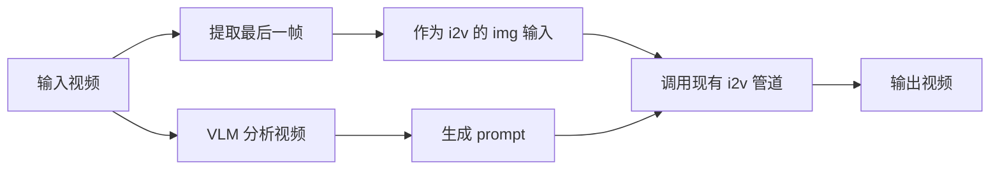

# Video-to-Video (V2V) 功能实现计划

为 Wan2.2 添加 Video-to-Video 生成功能，输入一个视频，自动提取最后一帧作为参考图，并用 VLM 生成视频描述作为 prompt。


### Dependencies

- `timm`

## ✅ 实现状态: 已完成

## 核心设计



## 设计决策

| 决策项 | 选择 |
|--------|------|
| VLM 模型 | `InternVL3_5-8B` |
| 视频采样帧数 | `num_segments=8` |
| Prompt 模板 | `"Describe this video in detail."` |
| 命令行入口 | `--task v2v-14B` |
| VLM 设备 | `vlm_device` 参数，支持多 GPU |

---

## 已完成的修改

### [video2video.py](file:///home/user1/workspace/juyi/Wan2.2/wan/video2video.py)

- ✅ 新增导入: `decord`, `transformers`, `numpy`
- ✅ `__init__` 添加 `vlm_path`, `vlm_device` 参数
- ✅ 新增 VLM helper 方法:
  - `_load_vlm()` - 延迟加载 VLM
  - `_build_vlm_transform()` - 构建图像变换
  - `_vlm_dynamic_preprocess()` - 动态图像分块
  - `_extract_last_frame()` - 提取视频最后一帧
  - `_summarize_video()` - 采样 8 帧，调用 VLM 生成描述
- ✅ 新增 `v2v()` 方法

---

### [generate.py](file:///home/user1/workspace/juyi/Wan2.2/generate.py)

- ✅ 添加 `v2v-14B` 到 `EXAMPLE_PROMPT`
- ✅ 添加 CLI 参数: `--video`, `--vlm_device`
- ✅ 添加 v2v 参数校验
- ✅ 添加 v2v 任务生成逻辑

---

### [configs/__init__.py](file:///home/user1/workspace/juyi/Wan2.2/wan/configs/__init__.py)

- ✅ 添加 `v2v_14B` 配置 (复用 `i2v_A14B`)
- ✅ 添加 `v2v-14B` 到 `WAN_CONFIGS` 和 `SUPPORTED_SIZES`

---

# 基础用法 - VLM 自动生成 prompt
python generate.py --task v2v-14B --video input.mp4 --ckpt_dir ./Wan2.2-I2V-A14B

# VLM 在不同 GPU 上运行
python generate.py --task v2v-14B --video input.mp4 --ckpt_dir ./Wan2.2-I2V-A14B --vlm_device cuda:1

# 使用自定义 prompt (跳过 VLM)
python generate.py --task v2v-14B --video input.mp4 --ckpt_dir ./Wan2.2-T2V-A14B --prompt "A cat playing"
```
