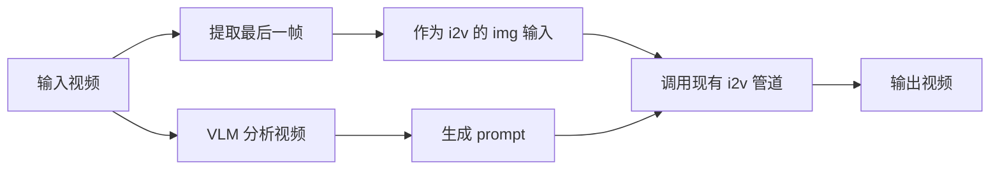

# Video-to-Video (V2V) 功能实现计划

为 Wan2.2 添加 Video-to-Video 生成功能，输入一个视频，自动提取最后一帧作为参考图，并用 VLM 生成视频描述作为 prompt。

## 核心设计



## 确定的设计决策

| 决策项 | 选择 |
|--------|------|
| VLM 模型 | `InternVL3_5-8B` |
| 视频采样帧数 | `num_segments=8` |
| Prompt 模板 | `"Describe this video in detail."` |
| 命令行入口 | 需要 `--task v2v` |
| VLM 设备 | 新增 `vlm_device` 参数，支持在不同 GPU 上运行 |

---

## 实现方案

### [MODIFY] [video2video.py](file:///home/user1/workspace/juyi/Wan2.2/wan/video2video.py)

#### 1. 新增导入
```python
from decord import VideoReader, cpu
from transformers import AutoModel, AutoTokenizer
import torchvision.transforms as T
from torchvision.transforms.functional import InterpolationMode
import numpy as np
```

#### 2. 修改 `__init__` 添加 VLM 支持
```python
def __init__(self, ..., vlm_path='OpenGVLab/InternVL3_5-8B', vlm_device=None):
    # ... 现有代码 ...
    self.vlm_model = None  # 延迟加载
    self.vlm_tokenizer = None
    self.vlm_path = vlm_path
    self.vlm_device = vlm_device  # 可指定不同 GPU
```

#### 3. 新增辅助方法

| 方法 | 功能 |
|------|------|
| `_load_vlm()` | 延迟加载 InternVL3 模型到指定设备 |
| `_extract_last_frame(video_path)` | 用 decord 提取视频最后一帧 |
| `_summarize_video(video_path)` | 采样 8 帧，调用 VLM 生成描述 |

#### 4. 新增 `v2v` 方法
```python
def v2v(self,
        video_path,
        max_area=704 * 1280,
        frame_num=121,
        shift=5.0,
        sample_solver='unipc',
        sampling_steps=40,
        guide_scale=5.0,
        n_prompt="",
        seed=-1,
        offload_model=True,
        custom_prompt=None):
    """
    Video-to-Video 生成
    
    1. 提取视频最后一帧 -> img
    2. VLM 总结视频内容 -> input_prompt (可用 custom_prompt 覆盖)
    3. 调用现有 i2v 方法
    """
```

---

### [MODIFY] [generate.py](file:///home/user1/workspace/juyi/Wan2.2/generate.py)

添加 `--task v2v` 命令行参数支持：
```bash
python generate.py --task v2v --video input.mp4 --ckpt_dir ./Wan2.2-T2V-A14B
```

新增参数：
- `--video`: 输入视频路径
- `--vlm_device`: VLM 运行设备 (如 `cuda:1`)

---

## 内存管理策略

VLM 在单独的 GPU 上运行，通过 `vlm_device` 参数指定：
```python
# 示例：主模型在 cuda:0，VLM 在 cuda:1
model = WanTI2V(config, ckpt_dir, device_id=0, vlm_device='cuda:1')
```

---

## 验证计划

1. 准备测试视频 `examples/test.mp4`
2. 测试命令：
   ```bash
   python generate.py --task v2v --video examples/test.mp4 --vlm_device cuda:1
   ```
3. 验证输出视频与输入内容连贯
